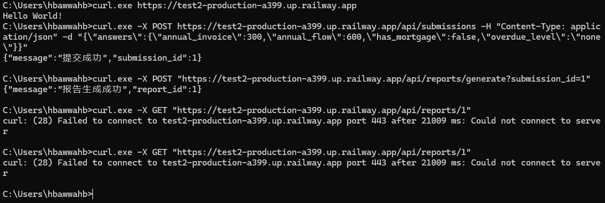

# 后端测试2

> 部署方式：**本地 + Docker + Railway**

---
以下会先给出三种启动方式与curl测试示例，再给出关键设计说明。

## 本地启动方式

### 1️. 安装依赖

```bash
pip install -r requirements.txt
```

### 2️. 初始化数据库

首次启动会自动创建 SQLite 数据库：

```text
instance/app.db
```

### 3️. 启动服务

```bash
python app.py
```
```bash
#api1~3
curl.exe -X POST "http://localhost:5000/api/submissions" -H "Content-Type: application/json" -d "{\"answers\":{\"annual_invoice\":300,\"annual_flow\":600,\"has_mortgage\":false,\"overdue_level\":\"none\"}}"
curl.exe -X POST "http://localhost:5000/api/reports/generate?submission_id=1"
curl.exe -X GET "http://localhost:5000/api/reports/1"
#管理接口，查询和删除
curl.exe -X GET "http://localhost:5000/api/admin/submissions"
curl.exe -X GET "http://localhost:5000/api/admin/reports"
curl.exe -X DELETE "http://localhost:5000/api/admin/reports/1"
curl.exe -X DELETE "http://localhost:5000/api/admin/submissions/1"


```


默认访问地址：

```text
http://localhost:5000
```

---

## Docker 启动

### 构建镜像

```bash
# 构建镜像
docker build -t backend-test2 .


# 重新运行容器（避免同名冲突）
docker rm -f backend_test2_run

# 启动（端口映射 + 持久化 DB）
docker run -d `
  --name backend_test2_run `
  -p 5000:5000 `
  -v ${PWD}\instance:/app/instance `
  backend-test2

# 查看日志确认启动成功
docker logs --tail 50 backend_test2_run
# 停止容器
docker stop backend_test2_run
# 删除容器
docker rm backend_test2_run


```
```bash
api1
@'
{"answers":{"annual_invoice":300,"annual_flow":600,"has_mortgage":false,"overdue_level":"none"}}
'@ | Set-Content -Encoding utf8 body.json

curl.exe -X POST "http://localhost:5000/api/submissions" `
  -H "Content-Type: application/json" `
  --data-binary "@body.json"

api2
curl.exe -X POST "http://localhost:5000/api/reports/generate?submission_id=1"

api3
curl.exe -X GET "http://localhost:5000/api/reports/1"

#管理接口，查询和删除
curl.exe -X GET "http://localhost:5000/api/admin/submissions"
curl.exe -X DELETE "http://localhost:5000/api/admin/submissions/1"
curl.exe -X GET "http://localhost:5000/api/admin/reports"
curl.exe -X DELETE "http://localhost:5000/api/admin/reports/1"


```


---

## 七、Railway 部署

* 项目已成功部署至 Railway
* 使用 Dockerfile 构建


**线上访问地址**

```text
https://test2-production-a399.up.railway.app
```
```bash
curl.exe -X POST https://test2-production-a399.up.railway.app/api/submissions -H "Content-Type: application/json" -d "{\"answers\":{\"annual_invoice\":300,\"annual_flow\":600,\"has_mortgage\":false,\"overdue_level\":\"none\"}}"

curl.exe -X POST "https://test2-production-a399.up.railway.app/api/reports/generate?submission_id=1"

curl.exe -X GET "https://test2-production-a399.up.railway.app/api/reports/1"

curl.exe -X GET "https://test2-production-a399.up.railway.app/api/admin/submissions"

curl.exe -X GET "https://test2-production-a399.up.railway.app/api/admin/reports"

curl.exe -X DELETE "https://test2-production-a399.up.railway.app/api/admin/reports/1"

curl.exe -X DELETE "https://test2-production-a399.up.railway.app/api/admin/submissions/1"


```
线上部署截图：（可能会超时）


---

## 关键设计说明

### a. 为什么这样建模？

* Submission 与 Report 拆分，Submission 仅负责保存用户原始输入（answers），Report 负责保存基于 Submission 计算得到的分析结果


* 后续拓展版本中，如果更新算法，Report 可基于 Submission 进行再次生成，保持数据完整性


---

### b. Report 使用 JSON 存储的优缺点

**优点**

* 方便使用，不需要额外建表
* 初期写代码量少
* 前端可直接使用 JSON 数据，后端无需额外转换

**缺点**

* 不利于数据整理和分析
* 无法直接对字段做索引


---

### c. 后续扩展思路

* **更多题目**
  * 新增 Question 表，存储：题目内容、选项、分值等

* **更多产品**
  * 将产品迁移至 Product 表，支持后台动态维护产品、上下架、规则调整
* **报告版本化**
  * 在 Report 表中增加字段，version，支持多版本报告生成与查询


---


